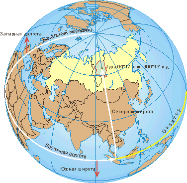

# Explore With Me

---

## Stack:
- Java 11
- Spring Boot
- Spring Data JPA
- PostgreSQL
- Docker
- Maven
- Postman

---

## Description

Free time is a valuable resource. Every day, we plan how to spend it – where to go and with whom. The most challenging part of this planning is finding information and negotiating. You need to consider many details: what events are planned, whether friends are available at that moment, how to invite everyone, and where to meet. "Explore With Me" is an event listing where you can propose any event, from an exhibition to a trip to the movies, and gather a group to participate in it.

---

## Microservice Architecture

The application consists of 2 services:

- **stats-service** - a part of the application that collects, stores, and provides statistics on views upon request.
- **main-service** - the core part of the application where all the application's logic takes place.

---

### Event Lifecycle:

- **PENDING**
- **CANCELED**
- **PUBLISHED**

### Actors:

- **Initiator** (owner of the event)
- **Administrator** (moderator)
- **Participant** (anyone who wants to take part in an event)

Initiators can create an event, which enters the **PENDING** state immediately after being saved in the database. Administrators can decide whether to approve or reject the publication.

Anyone can take part in an event by making a participation request. Initiators can approve or reject participation requests. Participation is only possible in a **PUBLISHED** event.

Each GET event request is saved in the statistics service.

---

## Main Service Database Schema

[View Schema](https://github.com/oleg-bobrikov/java-explore-with-me/blob/899090e983856e918a31890460bf209a1c41ca2d/main-serivce-schema-db.png)

## Stats Service Database Schema

[View Schema](https://github.com/oleg-bobrikov/java-explore-with-me/blob/899090e983856e918a31890460bf209a1c41ca2d/stats-db.png)

---

### PR [Link](https://github.com/oleg-bobrikov/java-explore-with-me/pull/5)